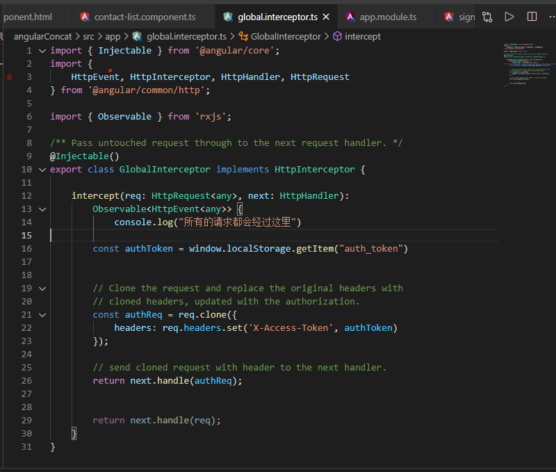

## Angular-Study 
## 1. 安装配置angular-cli   
    1.安装node     node -v

    2.安装npm    npm -v（node自带）

    3.安装python   python --version  

    4. 安装C++编译工具   安装Visual Studio （注意：不是Visual Studio Code 微软      开发工具） 其他操作系统 不需要
    npm install --gloabl --production windows-build-tools

    5. 安装脚手架      npm install -g @angular/cli；；；；

## 2.使用angular/cli  创建项目     ng new angular-demo  
## 3.启动项目  ng serve  


## 4 . 创建组件  用   cmd命令  ng generate component foo （foo组件名）
       组件使用  <app-foo/>


angular应用程序的八个主要构造模块的基础知识   

模块  组件  模板  元数据   
数据绑定  指令  服务   依赖注入

## 5. typeScript介绍 ： 
    
typeScript 是强类型 ，一旦定义数据的类型，则不能动态修改 
typeScript实质    = type类型的概念 + ECMAScript6  


好处：能够在编写时发现一些类型错误 ，能够避免很多低级错误
 
    引入：
1.本地编译搭建环境 npm i -g typescript       
     cmd命令窗口执行    tsc  ./01.ts 执行转化js   
            tsc  --version   tsc --help 查看帮助   查看版本号
2.在线编译 typescript  转化为 javascript    
typescript基础知识点：
    a. ts数据类型 ： boolean number  string number[]或者Array<number>  元组[number,string]  对象Object    任意类型any  函数空返回值void  null和underfind 变量声明  var  let  const    
    b.解构赋值   let [a,b] = Array[1,2]    
    c.剩余参数 function(...args:number){ //可以传多个数字参数 args.forEach()}
    d.数组展开操作符  ： let arr1 =[1,2,3]  let2=[4,5,6]  let arr =[...arr1,arr2]
        对象展开操作符 ：
```js
let obj1 = {foo :'bar'}  ;let obj2 ={ ...obj1, // , name:'Jack'}  //一般用于对象混入，拷贝
```
    e.typeScript 类的基本用法
    f.类的继承 
    h.类的（实例）访问修饰符       public(默认)     private   私有成员不可被继承 ，只能在类的内 部使用    protected （可被继承 ，不可外部使用（实例内部可使用））  em： publi  readonly   类似const   不可被修改 ；；； 
            简写 ：
```js
    class Person{ constructor（public name ：string ，public age：number ） {} }
```            
             
    j .类变量校验 
```js
     get age(value){return value}    赋值后调用set age(val){ if(val <0){ throw new Error('年龄不能赋值为负数')}}
```
    k  static   类（构造函数）  实例成员 ：只能通过new出来的实例访问    静态成员（static） ：也叫类本身的成员  ，只能通过类本身访问  
    L . 函数
```js
    可选函数 em: func(x:number,y?:number){}    
    默认参数   em: func(x:number,y:number=20){}   
    剩余参数 em: 
        function sum(...args:number[]){
             args.forEach((item:number):void =>{})
        }  
    箭头函数  em ： let add = （x:number , y:number）:number => x+y     
```    
    
    i:  for-of 循环  for(let val of arr){ console.log(val)}    转译为for循环  支持break

    o: 模块   模块通信  导出 em1：  export default xxx    em2： export const foo：String =  ‘bar’   em3：    export const foo：String =‘foo’     模块：导入   加载默认成员 em1：import xxx from ‘模块标识’   //按需加载模块成员    import {foo，bar} from ‘模块’  

    p. 总结落下知识点 ： interface 接口   用来约束对象的  

## 6. 写Todomvc案例   

  1.下载案列模板 todomvc-app-template   
       git clone http://github.com/tastejs/todomvc-app-template.git  
  2.导入css   yarn add todomvc-common todomvc-app-css  
    
@import url('todomvc-common/base.css');
@import url('todomvc-app-css/index.css');  
导入全局报错  重启解决QAQ   

3.    
<li class="completed" *ngFor="let todo of todos" />  循环写法  
<ng-template [ngIf]="todos.length">       ng-template写法  ng命令写法
<footer class="footer" *ngIf="todos.length"> 条件渲染 

4. 引入表单双向绑定 到主模块 (app)
    
import {FormsModule} from '@angular/forms';  
在主模块中添加该
imports: [
    BrowserModule,
    FormsModule
  ],
在input中的使用
 
<input name="check" class="toggle" type="checkbox" [(ngModel)]="todo.done">  代替了checked   (注意加name:"check" )

5.ngClass 决定是否启用class样式  
<li [ngClass]="{completed:todo.done}" *ngFor="let todo of todos">

6.切换所有的任务项目 
 every()  数组方法 ，判断数组所有的元素是否满足条件 :  
如果数组中检测到有一个元素不满足，则整个表达式返回 false ，且剩余的元素不会再进行检测。


7. 
 const {keyCode ,target} = e     等于 const keyCode = e.keyCode ; const target =e.target
filter() 方法创建一个新的数组，新数组中的元素是通过检查指定数组中符合条件的所有元素。


## 7. angular 路由 内置    
  
按照惯例，有一个独立模块来配置相关路由，这个模块类的名字叫做AppRoutingModule,位于src/app下的app-routing.module.ts文件中。

使用CLI生成它。  

//1.路由模块初始化 

ng generate module app-routing --flat --module=app

//2.配置路由表    ，在app-routing.modules.ts文件中的配置  

//4.
import {RouterModule,Routes} from '@angular/router'

//1.
import {SigninComponent} from './signin/signin.component'
import {SignupComponent} from './signup/signup.component'
//2.
const routes : Routes = [
  {
    path:'signin',
    component:SigninComponent
  },
  {
    path:'signup',
    component:SignupComponent
  }
]
//3.
@NgModule({
  declarations: [],
  imports: [
    CommonModule,
    RouterModule.forRoot(routes)
  ]
})
##  标签导航 routerLink
```js
<a routerLink="/signin">Already have an account? Login here.</a>
```
## 7.contact案列    

```js
1.angular 的表单验证
A. input控件

<input type="email"
        name="email" // 类似于key的标识  ，必须加上
       id="inputEmail" 
       class="form-control" 
       placeholder="Email address" 
       required  //验证不为空 
       autofocus
       [(ngModel)]="signupFrom.email" //双向绑定的数据
       #email ="ngModel" //模板引变量
       email="true" //必须开启
         minlength="6" //限制最短  
        maxlength="18" //限制最长

       >
B.input的css样式
为email.className ==" ng-pristine ng-valid ng-touched ng-invalid" 赋予不同的样式 
.ng-valid[required], .ng-valid .required{
    border-left: 5px solid #42A948;
}
.ng-invalid:not(form){
    border-left: 5px solid #a94442; 
}

C.input下的错误提示框
 <!-- 自己添加的验证规则 -->
      <div *ngIf="email_err_message" class="alert alert-danger">
          {{email_err_message}}
      </div>
      <!-- ng自带的验证规则 -->
      <div *ngIf="email.invalid && (email.dirty || email.touched)"
          class="alert alert-danger">

        <div *ngIf="email.errors.required">
          email is required
        </div>

        <div *ngIf="email.errors.email">
          Invalid in email 
        </div>
        
        
        <div *ngIf="email.errors.minlength">
          email must be at least 4 characters long.
        </div>
        <div *ngIf="email.errors.forbiddenName">
          email cannot be Bob.
        </div>
      </div>

D.angular  路由跳转   
1.组件中导入  
import {Router} from '@angular/router'   
2.在构造函数中 ： 
constructor(
    private http: HttpClient ,
    private router:Router
    )
3.跳转到根目录
this.router.navigate(['/'])

```

E.路由守卫  （已创建路由文件app-routing）判断token 是否存在并使用 
1. 在根目录下创建一个auth-guard.services.ts  ,内容：（附件可下载）


2. 在路由文件 routing中 
 
1.导入 
import { YourGuard } from '../auth-guard.services'（已上传附件）  ，并在需要使用改路由钩子函数的路由进行“canActivate”


2.导模板：
@NgModule({
  imports: [RouterModule.forRoot(routes)],
  exports: [RouterModule] ,
  providers: [YourGuard]
})


F.angualr http拦截器Interceptor  设置 全局请求token
  
1.创建一个 global.interceptor.ts （已上传附件）文件 
2.内容参见  https://angular.cn/guide/http  
.png)

3.导入app.modules.ts根模块中  
++import { GlobalInterceptor} from "./global.interceptor"
++import { HTTP_INTERCEPTORS} from "@angular/common/http"
+providers: [
    { provide: HTTP_INTERCEPTORS, useClass: GlobalInterceptor, multi: true },
  ],


