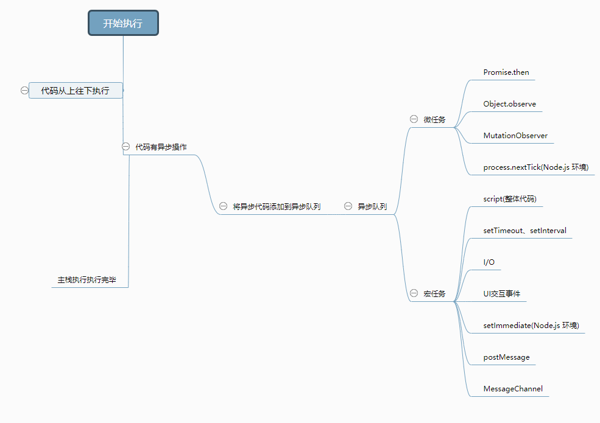
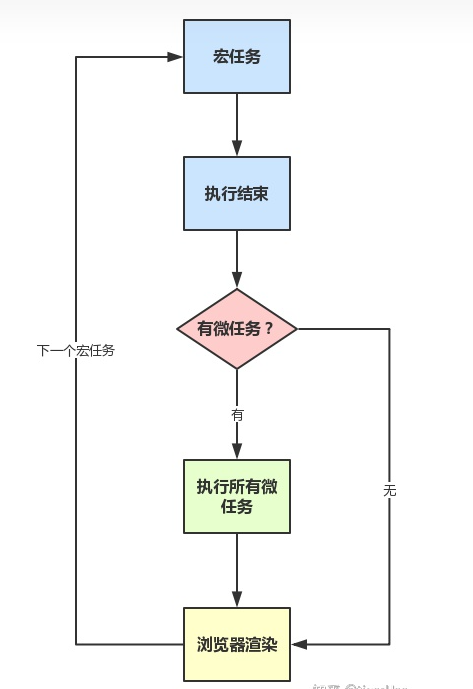

## H5新特性  -- Drag & Drop

被拖动的源对象可以触发的事件：

(1)ondragstart：源对象开始被拖动

(2)ondrag：源对象被拖动过程中(鼠标可能在移动也可能未移动)

(3)ondragend：源对象被拖动结束

拖动源对象可以进入到上方的目标对象可以触发的事件：

(1)ondragenter：目标对象被源对象拖动着进入

(2)ondragover：目标对象被源对象拖动着悬停在上方

(3)ondragleave：源对象拖动着离开了目标对象

(4)ondrop：源对象拖动着在目标对象上方释放/松手

拖拽API总共就是7个函数

## H5新特性 - - Web Worker

https://www.ruanyifeng.com/blog/2018/07/web-worker.html

Web Worker 的作用，就是为 JavaScript 创造多线程环境，允许主线程创建 Worker 线程，将一些任务分配给后者运行。在主线程运行的同时，Worker 线程在后台运行，两者互不干扰。等到 Worker 线程完成计算任务，再把结果返回给主线程。这样的好处是，一些计算密集型或高延迟的任务，被 Worker 线程负担了，主线程（通常负责 UI 交互）就会很流畅，不会被阻塞或拖慢。

Worker 线程一旦新建成功，就会始终运行，不会被主线程上的活动（比如用户点击按钮、提交表单）打断。这样有利于随时响应主线程的通信。但是，这也造成了 Worker 比较耗费资源，不应该过度使用，而且一旦使用完毕，就应该关闭。

Web Worker 有以下几个使用注意点。

（1）同源限制

分配给 Worker 线程运行的脚本文件，必须与主线程的脚本文件同源。

（2）DOM 限制

Worker 线程所在的全局对象，与主线程不一样，无法读取主线程所在网页的 DOM 对象，也无法使用document、window、parent这些对象。但是，Worker 线程可以navigator对象和location对象。

（3）通信联系

Worker 线程和主线程不在同一个上下文环境，它们不能直接通信，必须通过消息完成。

（4）脚本限制

Worker 线程不能执行alert()方法和confirm()方法，但可以使用 XMLHttpRequest 对象发出 AJAX 请求。

（5）文件限制

Worker 线程无法读取本地文件，即不能打开本机的文件系统（file://），它所加载的脚本，必须来自网络。

## 事件循环 event loop
<!--  -->

<!--  -->
<!--  -->

<!--  -->
1. 
 
2. 
 

3. nodejs模式 中   https://blog.csdn.net/hkh_1012/article/details/53453138
setTimeout采用的是类似IO观察者，setImmediate采用的是check观察者，而process.nextTick()采用的是idle观察者
三种观察者的优先级顺序是：idle观察者>>io观察者>check观察者（ process.nextTick  > setTimeout > setImmediate ）
但是在实际使用中 setImmediate 和 setTimeout  谁先执行却不是一定的 

运行机制

+ 在事件循环中，每进行一次循环操作称为 tick，每一次 tick 的任务处理模型是比较复杂的，但关键步骤如下：

- 执行一个宏任务（栈中没有就从事件队列中获取）
- 执行过程中如果遇到微任务，就将它添加到微任务的任务队列中
- 宏任务执行完毕后，立即执行当前微任务队列中的所有微任务（依次执行）
- 当前宏任务执行完毕，开始检查渲染，然后GUI线程接管渲染
- 渲染完毕后，JS线程继续接管，开始下一个宏任务（从事件队列中获取）
